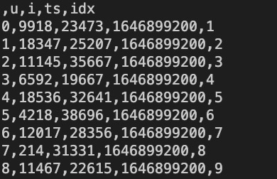

# CPDG: A Contrastive Pre-Training Method for Dynamic Graph Neural Networks

### Dependencies
- python >= 3.7
- pandas==1.1.0
- torch==1.6.0
- scikit-learn==0.23.1

------

### Data Preprocessing
The preprocessing code of all the experimental datasets (Link prediction data: Amazon, Gowalla, Meituan; Node classification data: Wikipedia, MOOC, Reddit) has been place in the **/process** folder.

The source data can be downloaded in below links:

- Amazon: https://jmcauley.ucsd.edu/data/amazon

- Gowalla: http://www.yongliu.org/datasets.html

- Wikipedia: http://snap.stanford.edu/jodie/wikipedia.csv

- MOOC: http://snap.stanford.edu/jodie/mooc.csv

- Reddit: http://snap.stanford.edu/jodie/reddit.csv

We have also provided the preprocessed data files in the Google Cloud Drive, you can obtain them by the following link:
https://drive.google.com/drive/folders/12yhG061oZVG4RzMMuhsplFO2Xe74aKKG

The preprocessed data example is as follows:

------

### Running
(i) Determine the data path after placing the preprocessed data.

(ii) Model pre-training through pretrain_cl.py [the example is as follows, find the location of the data through the corresponding path parameter]

`
python3 pretrain_cl.py 
--use_memory
--prefix tgn-amazon_beauty_pretrain_t-ts-bs1024
-d amazon_beauty_pretrain
--bs 1024
--gpu 0
--s_cl 1
--t_cl 1
--alpha 0.5
--seq_len 10
--data_type amazon
--task_type time_trans
--data_path [your path to access the dataset]
--model_path [your path to access the model]
--log_path [your path to save the log]
--check_path [your path to save the checkpoint]
--emb_path [your path to save the embedding]
--result_path [your path to save the results]
--seq_path [your path to save the EIE sequence]
`

(iii) Perform downstream fine-tuning tasks through downstream.py (link prediction) or downstream_nc.py (node classification) [the example is as follows, find the location of the data through the corresponding path parameter]

`
python3 downstream.py
--use_memory
--prefix tgn-amazon_beauty_downstream_t-lp-bs1024-lr0001
-d amazon_beauty_downstream
--bs 1024
--lr 0.0001
--pretrained 1
--use_seq 1
--data_type amazon
--task_type time_trans
--gpu 0
--n_runs 5
--pretrained_model_path [your path to access the pre-trained model parameter]
--pretrained_emb_path [your path to access the pre-trained node embedding]
--pretrained_seq_path [your path to access the EIE sequence]
--data_path [your path to access the dataset]
--model_path [your path to access the model]
--log_path [your path to save the log]
--check_path [your path to save the checkpoint]
--emb_path [your path to save the embedding]
--result_path [your path to save the results]
`
